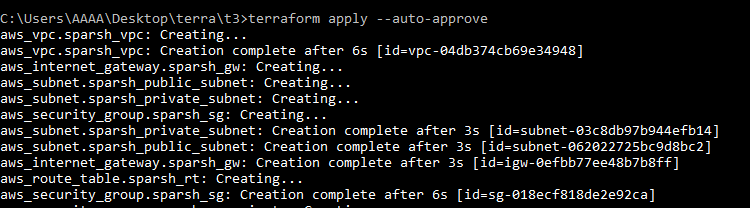

# Cloud-task-4

# Project Description :-

1.  Write an Infrastructure as code using terraform, which automatically create a VPC.
2.  In that VPC we have to create 2 subnets:
    1.   public  subnet [ Accessible for Public World! ] 
    2.   private subnet [ Restricted for Public World! ]
3. Create a public facing internet gateway for connect our VPC/Network to the internet world and attach this gateway to our VPC.
4. Create  a routing table for Internet gateway so that instance can connect to outside world, update and associate it with public subnet.
5.  Create a NAT gateway for connect our VPC/Network to the internet world  and attach this gateway to our VPC in the public network
6.  Update the routing table of the private subnet, so that to access the internet it uses the nat gateway created in the public subnet
7.  Launch an ec2 instance which has Wordpress setup already having the security group allowing  port 80 sothat our client can connect to our wordpress site. Also attach the key to instance for further login into it.
8.  Launch an ec2 instance which has MYSQL setup already with security group allowing  port 3306 in private subnet so that our wordpress vm can connect with the same. Also attach the key with the same.

Note: Wordpress instance has to be part of public subnet so that our client can connect to our site. 
MySql instance has to be part of private  subnet so that outside world can't connect to it.
Don't forgot to add auto ip assign and auto dns name assignment option to be enabled.

# What is Wordpress ?

WordPress (WP, WordPress.org) is a free and open-source content management system (CMS) written in PHP and paired with a MySQL or MariaDB database. Features include a plugin architecture and a template system, referred to within WordPress as Themes. WordPress was originally created as a blog-publishing system but has evolved to support other types of web content including more traditional mailing lists and forums, media galleries, membership sites, learning management systems (LMS) and online stores. WordPress is used by more than 60 million websites, including 33.6% of the top 10 million websites as of April 2019, WordPress is one of the most popular content management system solutions in use. WordPress has also been used for other application domains such as pervasive display systems (PDS).

# What is Bastion Host ?

A bastion host is a special-purpose computer on a network specifically designed and configured to withstand attacks. The computer generally hosts a single application, for example a proxy server, and all other services are removed or limited to reduce the threat to the computer. . It is hardened in this manner primarily due to its location and purpose, which is either on the outside of a firewall or in a demilitarized zone (DMZ) and usually involves access from untrusted networks or computers.
A bastion host is a server whose purpose is to provide access to a private network from an external network, such as the Internet. Because of its exposure to potential attack, a bastion host must minimize the chances of penetration. For example, you can use a bastion host to mitigate the risk of allowing SSH 

# Steps :-

**Step - 1:**  First of all, configure your AWS profile in your local system using cmd. Fill your details & press Enter.

                  aws configure --profile Sparsh
                  AWS Access Key ID [****************WO3Z]:
                  AWS Secret Access Key [****************b/hJ]:
                  Default region name [ap-south-1]:
                  Default output format [None]:
                  
                  
                 
**Step - 2:** Next, we need to create a VPC. Amazon Virtual Private Cloud (Amazon VPC) lets you provision a logically isolated section of the AWS Cloud where you can launch AWS resources in a virtual network that you define. You have complete control over your virtual networking environment, including selection of your own IP address range, creation of subnets, and configuration of route tables and network gateways. You can use both IPv4 and IPv6 in your VPC for secure and easy access to resources and applications.

The terrfaorm code to create a VPC is as follows :-

                resource "aws_vpc" "sparsh_vpc" {
                cidr_block = "192.168.0.0/16"
                instance_tenancy = "default"
                enable_dns_hostnames = true
                tags = {
                  Name = "sparsh_vpc"
                }
              }
              
              
              
**Step - 3:** Now, we need to create two subnets in this VPC :

a) public subnet [ Accessible for Public World! ] 

b) private subnet [ Restricted for Public World! ]

Subnet is “part of the network”, in other words, part of entire availability zone. Each subnet must reside entirely within one Availability Zone and cannot span zones.
The terraform code to create both the Private & the Public Subnet is as follows :

                resource "aws_subnet" "sparsh_public_subnet" {
                vpc_id = "${aws_vpc.sparsh_vpc.id}"
                cidr_block = "192.168.0.0/24"
                availability_zone = "ap-south-1a"
                map_public_ip_on_launch = "true"
                tags = {
                  Name = "sparsh_public_subnet"
                }
              }
              
              
              
              resource "aws_subnet" "sparsh_private_subnet" {
                vpc_id = "${aws_vpc.sparsh_vpc.id}"
                cidr_block = "192.168.1.0/24"
                availability_zone = "ap-south-1a"
                tags = {
                  Name = "sparsh_private_subnet"
                }
              }
              
              
 
**Step - 4:** Next, we create a Public facing Internet Gateway. An internet gateway is a horizontally scaled, redundant, and highly available VPC component that allows communication between your VPC and the internet. 

The terraform code to create the Gateway is as follows :

                resource "aws_internet_gateway" "sparsh_gw" {
                vpc_id = "${aws_vpc.sparsh_vpc.id}"
                tags = {
                  Name = "sparsh_gw"
                }
              }
              
              
**Step - 5:** Next, we create a Routing Table & associate it with the Public Subnet. A routing table, or routing information base (RIB), is an electronic file or database-type object that is stored in a router or a networked computer, holding the routes (and in some cases, metrics associated with those routes) to particular network destinations. This information contains the topology of the network close to it. The terrafrom code for the same is as follows :

                resource "aws_route_table" "sparsh_rt" {
                vpc_id = "${aws_vpc.sparsh_vpc.id}"

                route {
                  cidr_block = "0.0.0.0/0"
                  gateway_id = "${aws_internet_gateway.sparsh_gw.id}"
                }

                tags = {
                  Name = "sparsh_rt"
                }
              }

              resource "aws_route_table_association" "sparsh_rta" {
                subnet_id = "${aws_subnet.sparsh_public_subnet.id}"
                route_table_id = "${aws_route_table.sparsh_rt.id}"
              }
              
              
              
              
**Step - 6:** Now, we create our security group which will be used while launching Wordpress. This security group has the permissions for outside connectivity.
A security group acts as a virtual firewall for your EC2 instances to control incoming and outgoing traffic. Inbound rules control the incoming traffic to your instance, and outbound rules control the outgoing traffic from your instance. Security groups are associated with network interfaces.

               resource "aws_security_group" "sparsh_sg" {

                name        = "sparsh_sg"
                vpc_id      = "${aws_vpc.sparsh_vpc.id}"

                ingress {
                
                  description = "allow_http"
                  from_port   = 80
                  to_port     = 80
                  protocol    = "tcp"
                  cidr_blocks = [ "0.0.0.0/0"]

                }

                   ingress {
                 
                   description = "allow_ssh"
                   from_port   = 22
                   to_port     = 22
                   protocol    = "tcp"
                   cidr_blocks = ["0.0.0.0/0"]
                 }
                 
                 ingress {
                 
                   description = "allow_icmp"
                   from_port   = 0
                   to_port     = 0
                   protocol    = "tcp"
                   cidr_blocks = ["0.0.0.0/0"]
                 }
                 
                 ingress {
                 
                   description = "allow_mysql"
                   from_port   = 3306
                   to_port     = 3306
                   protocol    = "tcp"
                   cidr_blocks = ["0.0.0.0/0"]
                 }

                 egress {
                   from_port   = 0
                   to_port     = 0
                   protocol    = "-1"
                   cidr_blocks = ["0.0.0.0/0"]
                 }
                 
                 
                  tags = {

                  Name = "sparsh_sg"
                }
              }
              
              
              
              
 **Bastion Host for this security group-**
 
       resource "aws_security_group" "bastion_ssh_only" {
              depends_on=[aws_subnet.sparsh_public_subnet]
              name        = "bastion_ssh_only"
              description = "It allows bastion ssh inbound traffic"
              vpc_id      =  aws_vpc.sparsh_vpc.id

            ingress {
                description = "allow bastion with ssh only"
                from_port   = 22
                to_port     = 22
                protocol    = "tcp"
                cidr_blocks = ["0.0.0.0/0"]
                ipv6_cidr_blocks =  ["::/0"]
              }

            egress {
                from_port   = 0
                to_port     = 0
                protocol    = "-1"
                cidr_blocks = ["0.0.0.0/0"]
                ipv6_cidr_blocks =  ["::/0"]
              }

              tags = {
                Name = "bastion_ssh_only"
              }
            }

**Step : 7** Now, we create another security group which will be used to launch MySQL. This security group will keep the MySQL accessible only through the wordpress and not through outside world.

                resource "aws_security_group" "sparsh_sg_private" {

                name        = "sparsh_sg_private"
                vpc_id      = "${aws_vpc.sparsh_vpc.id}"
              
                ingress {
                
                 description = "allow_mysql"
                 from_port   = 3306
                 to_port     = 3306
                 protocol    = "tcp"
                 security_groups = [aws_security_group.sparsh_sg.id]
                 
               }

               ingress {
               
                 description = "allow_icmp"
                 from_port   = -1
                 to_port     = -1
                 protocol    = "icmp"
                 security_groups = [aws_security_group.sparsh_sg.id]
                 
               }

               egress {
               
                from_port   = 0
                to_port     = 0
                protocol    = "-1"
                cidr_blocks = ["0.0.0.0/0"]
                ipv6_cidr_blocks =  ["::/0"]
              }
              
              
              tags = {

                  Name = "sparsh_sg_private"
                }
              }
              
            
            
 **Bastion Host for this security group-**
 
         resource "aws_security_group" "bastion_host_sql_only" {
                depends_on=[aws_subnet.vishnu_public_subnet]
                name        = "bastion_with_ssh_only"
                description = "It allows bastion host with ssh only"
                vpc_id      =  aws_vpc.vishnu_vpc.id

              ingress {
                  description = "bastion host ssh only "
                  from_port   = 22
                  to_port     = 22
                  protocol    = "tcp"
                  security_groups=[aws_security_group.bastion_ssh_only.id]

              }

              egress {
                  from_port   = 0
                  to_port     = 0
                  protocol    = "-1"
                  cidr_blocks = ["0.0.0.0/0"]
                }

                tags = {
                  Name = "bastion_with_ssh_only"
                }
              } 
              
              
         
         
 
**Step - 8:** Next, we create a NAT gateway to connect our VPC/Network to the internet world. NAT Gateway is a highly available AWS managed service that makes it easy to connect to the Internet from instances within a private subnet in an Amazon Virtual Private Cloud (Amazon VPC). Previously, you needed to launch a NAT instance to enable NAT for instances in a private subnet

          resource "aws_eip" "sparsh-ip" {
            vpc              = true
            public_ipv4_pool = "amazon"
          }
          output "new_output" {
              value=  aws_eip.sparsh-ip
          }

          resource "aws_nat_gateway" "sparsh_nat_gw" {
            depends_on    = [aws_eip.sparsh-ip]
            allocation_id = aws_eip.sparsh-ip.id
            subnet_id     = aws_subnet.sparsh_public_subnet.id

            tags = {
              Name = "sparsh_nat_gw"
            }
          }

          resource "aws_route_table" "vp_private_subnet_for_rt" {
            depends_on = [aws_nat_gateway.sparsh_nat_gw]
            vpc_id = aws_vpc.sparsh_vpc.id
            route {
              cidr_block = "0.0.0.0/0"

              gateway_id = aws_nat_gateway.sparsh_nat_gw.id
            }
            tags = {
              Name = "vp_private_subnet_for_rt"
            }
          }

          resource "aws_route_table_association" "vp_private_subnet_for_rt_association" {
            depends_on = [aws_route_table.vp_private_subnet_for_rt]
            subnet_id      = aws_subnet.sparsh_private_subnet.id
            route_table_id = aws_route_table.vp_private_subnet_for_rt.id
          }
              
 

**Step - 8:** Now, we are ready to go. We launch our Wordpress and MySQL instances using all the resources that we have created above. 
  
  **Wordpress* -

            resource "aws_instance" "wordpress" {
            
            ami           = "ami-ff82f990"
            instance_type = "t2.micro"
            key_name      =  "sparsh_key"
            subnet_id     = "${aws_subnet.sparsh_public_subnet.id}"
            security_groups = ["${aws_security_group.sparsh_sg.id}"]
            associate_public_ip_address = true
            availability_zone = "ap-south-1a"

            tags = {
              Name = "sparsh_wordpress"
              }
            } 

 **MySQL** -
 
                        resource "aws_instance" "sql" {
                        ami             =  "ami-08706cb5f68222d09"
                        instance_type   =  "t2.micro"
                        key_name        =  "sparsh_key"
                        subnet_id     = "${aws_subnet.sparsh_private_subnet.id}"
                        availability_zone = "ap-south-1a"
                        security_groups = ["${aws_security_group.sparsh_sg_private.id}"]
                        depends_on      = [aws_security_group.bastion_host_sql_only,aws_security_group.bastion_ssh_only]
                        
                        tags = {
                         Name = "sparsh_sql"
                         }
                       } 
                       
                       
**Bastion Host**

              resource "aws_instance" "bastion_host" {
                            depends_on=[aws_security_group.bastion_ssh_only]
                            ami             =  "ami-08706cb5f68222d09"
                            instance_type   =  "t2.micro"
                            key_name        =  "task4"
                            subnet_id= aws_subnet.sparsh_public_subnet.id 
                            vpc_security_group_ids=[aws_security_group.bastion_ssh_only.id]
                            tags = {
                              Name = "bastion_host"
                            }
                          }
                          
                          
                          
**Step - 9:** Now, we run our terraform code. For doing so, we first run the command **terraform init**. This will download the necessary plugins.
 
 
 
 
 Then, we run the command **terraform apply --auto-approve**. This will run the code and create the mentioned resources on the configured AWS Cloud.
 
 
 
  Soon, we see that all our resources are added !!
 
 
 
 
 
 Now, we go to our AWS dashboard & see our Wordpress & MYSQL running in the EC2 section.
 
 
 
 
  We can access our Wordpress site using the Public IP address that is mentioned in the instance description.
 
 
 
 Eureka !! We did it !!
 
We successfully launched a Web Portal for our company with a dedicated Database Server that can be accessed only by the Wordpress, facilitating the security of our content.

Now sit back & congratulate yourself for doing this !!

